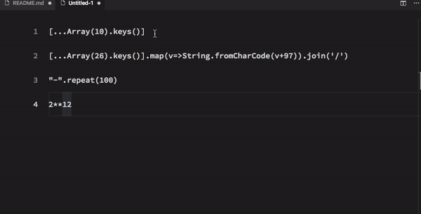

# JS to Text

## Install

In the command palette (`F1`) select Install Extension and search for **js2text**

## Usage

This command works with the currently selected text, not the entire contents of a file. Multi-select is also supported. If you want to convert an entire fall, then select all text `Ctrl+a`, and then run one of the available commands.

In the command palette (`F1`) type **JS to Text**. You should see the following command:

- Convert JS to Text

## Demo 

### Convert JS to Text

This command uses the JavaScript eval function to compile input and return output in json .

## Support

nkitku@github.com
